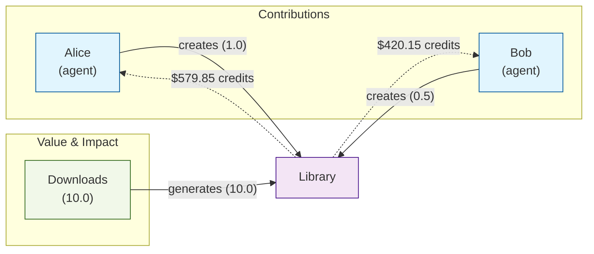
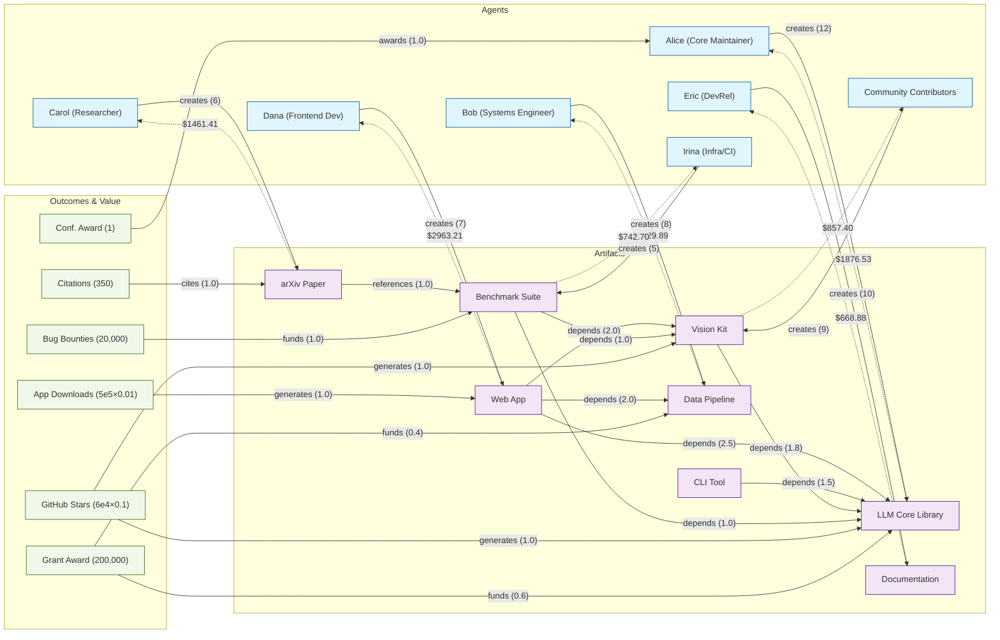
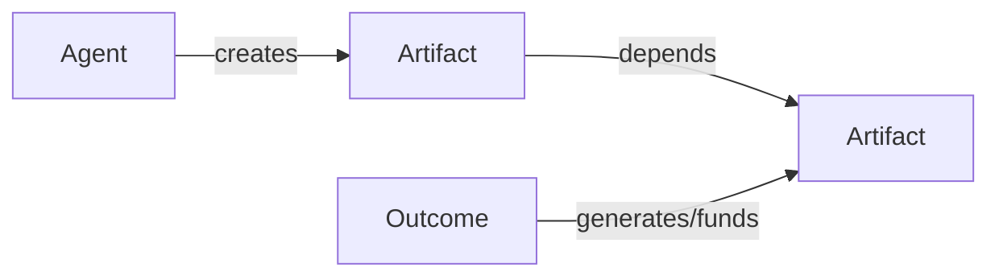
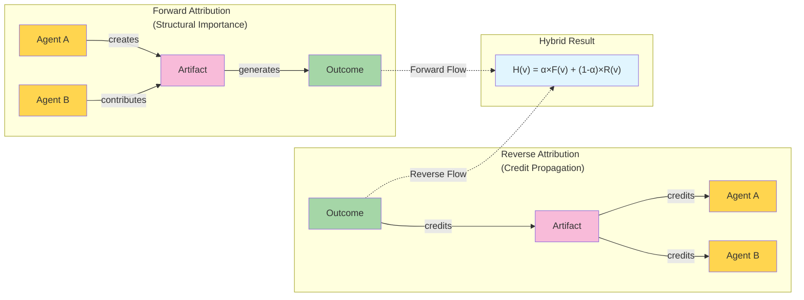

### Hybrid PageRank Impact Evaluator

A TypeScript implementation of a hybrid attribution algorithm that blends forward PageRank (structural influence) with reverse personalized PageRank (credit propagation from outcomes) on Agent–Artifact–Outcome graphs.

- **Bidirectional attribution**: forward structure + reverse outcome credit
- **Configurable**: per-edge and per-node weights, α balance, normalization
- **Auditable**: explicit paths of influence; see `paper.md` for details

### Install

Requires Bun (or Node).

```bash
bun install
```

### Quick start (TypeScript)

```ts
import { AttributionEngine } from "../src";
import type { Node, Edge, Config } from "../src";

const nodes: Node[] = [
  { id: "alice", type: "agent" },
  { id: "bob", type: "agent" },
  { id: "library", type: "artifact" },
  { id: "downloads", type: "outcome" },
];

const edges: Edge[] = [
  { from: "alice", to: "library", type: "creates", weight: 1.0 },
  { from: "bob", to: "library", type: "creates", weight: 0.5 },
  { from: "downloads", to: "library", type: "generates", weight: 10.0 },
];

const config: Partial<Config> = {
  alpha: 0.5, // blend forward vs. reverse (0..1)
  damping: 0.85, // PageRank damping
  weights: {
    edges: { creates: 1.0, depends: 1.0, generates: 1.0 },
    nodesByType: { agent: 1.0, artifact: 1.0, outcome: 1.0 },
  },
};

const engine = new AttributionEngine(config);
const scores = engine.evaluate(nodes, edges);
const reward = engine.reward(scores, 1000);
```

Example output (values may vary with configuration):

```text
Scores:
alice  0.169954
bob    0.123145

Reward (pool=1000):
alice  579.85
bob    420.15

```



### Run the included example

An OSS-flavored dataset with α-sensitivity is provided in `examples/oss.ts`.

```bash
bun run examples/oss.ts
```

This prints sorted agent scores, a reward split, and a small α sweep.

#### $5,000 grant allocation + counterfactuals

A focused script allocates a $5,000 pool and reports a counterfactual where the grant outcome is removed to show attribution via that channel.

```bash
bun run examples/grant.ts
```

It prints the payout table and a Δ column vs. the “no grant” counterfactual, indicating how much of each agent’s payout is due to the grant edges.

- Read the full explainer and see charts in [docs/grant.md](docs/grant.md).

#### α sweep (structure vs. outcomes)

Explore how the hybrid balance α shifts attribution between forward structure and reverse outcome credit. The script computes payouts at multiple α values.

```bash
bun run examples/alpha-sweep.ts
```

- Read the short explainer in [docs/alpha-sweep.md](docs/alpha-sweep.md).

#### Sample output

See the full dataset chart and output in `docs/oss.md`.

Numbers will vary with config, weights, and α.

### Full OSS graph with payouts



### Algorithm overview

- Build a forward directed graph from `nodes` and `edges` with configurable multipliers.
- Build a reverse graph that keeps edges originating from outcome nodes as-is, while reversing other edges to propagate credit upstream.
- Run PageRank on both graphs; seed reverse pass with a personalization vector over outcome nodes derived from outcome→\* edges (uniform if none).
- Combine for each agent id: $H(v) = \alpha\,F(v) + (1-\alpha)\,R(v)$.

See `paper.md` for background, rationale, and design choices.

### Visual overview

Simplified node types and flows:





See the OSS example chart and payouts in `docs/oss.md`.

### Configuration reference (`Config`)

- **alpha**: number in [0, 1] balancing forward vs. reverse.
- **damping**: PageRank damping factor.
- **normalization.edgeWeight**: `"none" | "perTypeSum" | "perSourceTypeSum" | "perTypeMax"` with optional `transform: "none" | "log1p"` and `epsilon`.
- **weights.edges**: record of multipliers by edge type (e.g., `creates`, `depends`, `funds`, `generates`, `awards`).
- **weights.nodesByType**: `{ agent, artifact, outcome }` multipliers.
- **weights.nodesById**: optional per-node overrides.

Only `agent` nodes receive hybrid scores; use `reward(scores, pool)` to normalize to a reward budget.

### Project layout

- `src/`: library code
  - `index.ts`: `AttributionEngine`, `Node`, `Edge`, `Config`
  - `pagerank-personaliization.ts`: PageRank with personalization support
- `examples/`: runnable example(s)
  - `oss.ts`: open‑source ecosystem example with α sensitivity
- `paper.md`: conceptual background and design notes

### Scripts

The repository uses Bun. You can run files directly, e.g. `bun run examples/oss.ts`.

### References

For a deeper dive, including model, configuration, and use cases, read `paper.md`.
