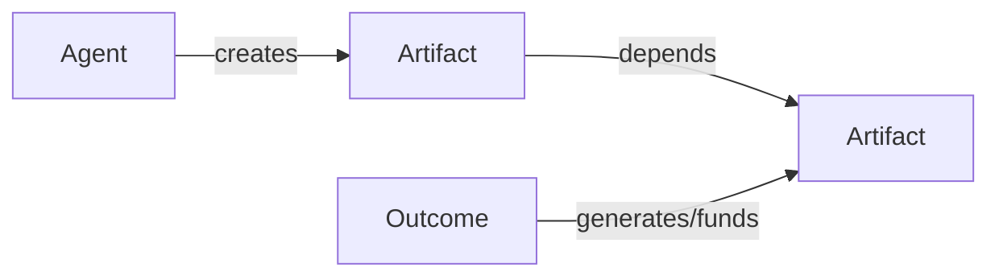
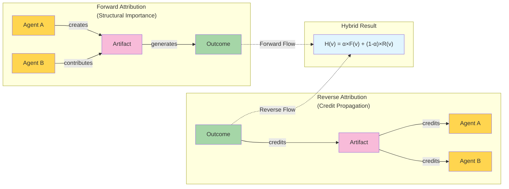

### Hybrid PageRank Impact Evaluator

A TypeScript implementation of a hybrid attribution algorithm that blends forward PageRank (structural influence) with reverse personalized PageRank (credit propagation from outcomes) on Agent–Artifact–Outcome graphs.

- **Bidirectional attribution**: forward structure + reverse outcome credit
- **Configurable**: per-edge and per-node weights, α balance, normalization
- **Auditable**: explicit paths of influence; see `paper.md` for details

### Install

Requires Bun (or Node).

```bash
bun install
```

### Quick start (TypeScript)

```ts
import { AttributionEngine, type Node, type Edge, type Config } from './src/index.ts';

const nodes: Node[] = [
  { id: 'alice', type: 'agent' },
  { id: 'library', type: 'artifact' },
  { id: 'downloads', type: 'outcome' }
];

const edges: Edge[] = [
  { from: 'alice', to: 'library', type: 'creates', weight: 1.0 },
  { from: 'downloads', to: 'library', type: 'generates', weight: 10.0 }
];

const config: Partial<Config> = {
  alpha: 0.5,        // blend forward vs. reverse (0..1)
  damping: 0.85,     // PageRank damping
  weights: {
    edges: { creates: 1.0, depends: 1.0, generates: 1.0 },
    nodesByType: { agent: 1.0, artifact: 1.0, outcome: 1.0 }
  }
};

const engine = new AttributionEngine(config);
const scores = engine.evaluate(nodes, edges);      // agent → hybrid score
const reward = engine.reward(scores, 1000);        // normalize to a pool

console.log(scores);
console.log(reward);
```

### Run the included example

An OSS-flavored dataset with α-sensitivity is provided in `examples/oss.ts`.

```bash
bun run examples/oss.ts
```

This prints sorted agent scores, a reward split, and a small α sweep.

#### Sample output

```text
--- Presentation Dataset: Open-Source AI Toolkit ---
Nodes: 21, Edges: 23

Top Agents by Hybrid Score:
Dana (Frontend Dev)          0.052067
Alice (Core Maintainer)      0.032973
Carol (Researcher)           0.025679
Bob (Systems Engineer)       0.025125
Community Contributors       0.015065
Irina (Infra/CI)             0.013050
Eric (DevRel)                0.011753

Reward Split (pool=10,000):
Dana (Frontend Dev)          2963.21
Alice (Core Maintainer)      1876.53
Carol (Researcher)           1461.41
Bob (Systems Engineer)       1429.89
Community Contributors       857.40
Irina (Infra/CI)             742.70
Eric (DevRel)                668.88

Alpha Sensitivity:
Agent                       α=0       α=0.25    α=0.5     α=0.75    α=1       
------------------------------------------------------------------------------
Dana (Frontend Dev)         0.089587  0.072532  0.055478  0.038423  0.021369  
Alice (Core Maintainer)     0.024955  0.028599  0.032244  0.035888  0.039533  
Carol (Researcher)          0.030946  0.028552  0.026157  0.023763  0.021369  
Bob (Systems Engineer)      0.029715  0.027629  0.025542  0.023455  0.021369  
Community Contributors      0.007361  0.010863  0.014365  0.017867  0.021369  
Irina (Infra/CI)            0.002882  0.007504  0.012126  0.016747  0.021369  
Eric (DevRel)               0.000000  0.005342  0.010684  0.016027  0.021369  
```

Numbers will vary with config, weights, and α.

### Algorithm overview

- Build a forward directed graph from `nodes` and `edges` with configurable multipliers.
- Build a reverse graph that keeps edges originating from outcome nodes as-is, while reversing other edges to propagate credit upstream.
- Run PageRank on both graphs; seed reverse pass with a personalization vector over outcome nodes derived from outcome→* edges (uniform if none).
- Combine for each agent id: \( H(v) = \alpha\,F(v) + (1-\alpha)\,R(v) \).

See `paper.md` for background, rationale, and design choices.

### Visual overview

Simplified node types and flows:





### Configuration reference (`Config`)

- **alpha**: number in [0, 1] balancing forward vs. reverse.
- **damping**: PageRank damping factor.
- **normalization.edgeWeight**: `"none" | "perTypeSum" | "perSourceTypeSum" | "perTypeMax"` with optional `transform: "none" | "log1p"` and `epsilon`.
- **weights.edges**: record of multipliers by edge type (e.g., `creates`, `depends`, `funds`, `generates`, `awards`).
- **weights.nodesByType**: `{ agent, artifact, outcome }` multipliers.
- **weights.nodesById**: optional per-node overrides.

Only `agent` nodes receive hybrid scores; use `reward(scores, pool)` to normalize to a reward budget.

### Project layout

- `src/`: library code
  - `index.ts`: `AttributionEngine`, `Node`, `Edge`, `Config`
  - `pagerank-personaliization.ts`: PageRank with personalization support
- `examples/`: runnable example(s)
  - `oss.ts`: open‑source ecosystem example with α sensitivity
- `paper.md`: conceptual background and design notes

### Scripts

The repository uses Bun. You can run files directly, e.g. `bun run examples/oss.ts`.

### References

For a deeper dive, including model, configuration, and use cases, read `paper.md`.
