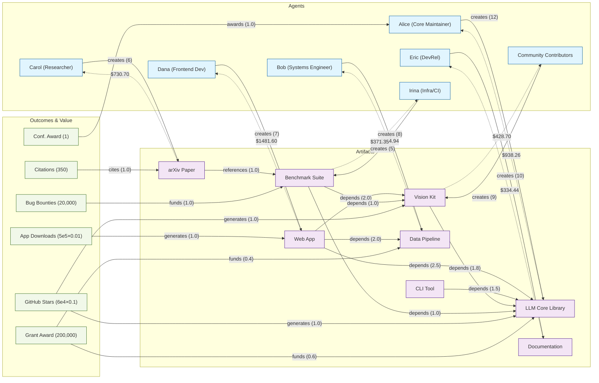

### $5,000 Grant Allocation: OSS Presentation Graph

Source: `examples/grant.ts`. This scenario allocates a $5,000 pool over the OSS presentation graph using the hybrid PageRank evaluator (α=0.55). It also reports a counterfactual where the grant outcome is removed to show how much of each agent's payout is attributable to the grant channel.

Run:

```bash
bun run examples/grant.ts
```



Numbers will vary with config, weights, and α.

### What this chart shows

- **Node types**
  - **Agents**: people/teams who create artifacts.
  - **Artifacts**: outputs (libraries, apps, docs, papers).
  - **Outcomes**: value signals (downloads, stars, citations, grants, bounties, awards).

- **Forward edges (solid)**
  - **creates**: Agent → Artifact with effort weights.
  - **depends/references**: Artifact → Artifact showing structural leverage.
  - **generates/funds/cites/awards**: Outcome → Artifact/Agent injecting value.

- **Reverse edges (dotted payouts)**
  - Artifact -.-> Agent labeled with payout dollars from the $5,000 pool (hybrid PageRank result).

- **How value moves**
  - Outcomes feed value into specific artifacts/agents.
  - Dependencies pull credit upstream toward foundational artifacts.
  - Hybrid score combines forward structure with reverse value (α=0.55 here), then normalizes to the pool.

### Sample output

Top Agents by Hybrid Score:

| Agent | Score |
|---|---:|
| Dana (Frontend Dev) | 0.052067 |
| Alice (Core Maintainer) | 0.032973 |
| Carol (Researcher) | 0.025679 |
| Bob (Systems Engineer) | 0.025125 |
| Community Contributors | 0.015065 |
| Irina (Infra/CI) | 0.013050 |
| Eric (DevRel) | 0.011753 |

Reward Split (pool=$5,000):

| Agent | Payout |
|---|---:|
| Dana (Frontend Dev) | $1481.60 |
| Alice (Core Maintainer) | $938.26 |
| Carol (Researcher) | $730.70 |
| Bob (Systems Engineer) | $714.94 |
| Community Contributors | $428.70 |
| Irina (Infra/CI) | $371.35 |
| Eric (DevRel) | $334.44 |

### Counterfactual: No Grant outcome

We remove only the grant edges (i.e., `grant → llm-core`, `grant → data-pipeline`) and recompute. The Δ below is the change vs. the baseline payouts above.

| Agent | Δ vs. baseline |
|---|---:|
| Carol (Researcher) | -$1593.85 |
| Dana (Frontend Dev) | +$964.12 |
| Bob (Systems Engineer) | +$389.37 |
| Alice (Core Maintainer) | +$311.64 |
| Irina (Infra/CI) | -$140.68 |
| Community Contributors | +$60.53 |
| Eric (DevRel) | +$8.86 |

Interpretation:

- **Attribution of the grant channel**: Agents and artifacts connected to the funded items capture more credit in the baseline than in the counterfactual. The negative Δ for Carol indicates her payout is strongly supported by the grant-driven value path through research outputs and dependencies; positive Δ values indicate beneficiaries when the grant influence is removed.
- **Sensitivity levers**: Adjust α to emphasize structure (α→1) or outcomes (α→0), or change edge multipliers (e.g., down‑weight `depends`) to test assumptions about infrastructure leverage.

### Discussion

- **Governance levers**: The grant allocation reflects value judgments encoded in α and edge-type multipliers. Communities can transparently tune these to match norms (e.g., emphasizing funding over social signals).
- **Counterfactual insight**: Removing the grant channel highlights who is most dependent on funding signals versus organic structure and demand. This supports debates about channel reliability and gaming risk.
- **Fairness and visibility**: Infrastructure contributors may be under‑credited without adequate `depends` weighting; DevRel may surface more if documentation and adoption outcomes are boosted.
- **Limitations**: Results depend on measurement coverage and weight choices. Combine with qualitative review and robustness checks (α sweep, ablations) before payouts.

### Example narrative

- A foundation runs a quarterly $5k micro‑grant for an OSS AI toolkit. The toolkit’s web app drove downloads, the core library got a grant, and the research paper received citations. The committee wants an auditable split rather than subjective voting.
- They run this evaluator, publish the payout table, and include the “no‑grant” counterfactual so stakeholders can see how much funding shifted rewards versus organic demand and dependencies.

### Why it’s important

- Converts diffuse impact signals (downloads, grants, citations) into a transparent payout table that can be audited and debated.
- The counterfactual builds trust by showing how a single channel (grants) changes the split, informing future funding design.


