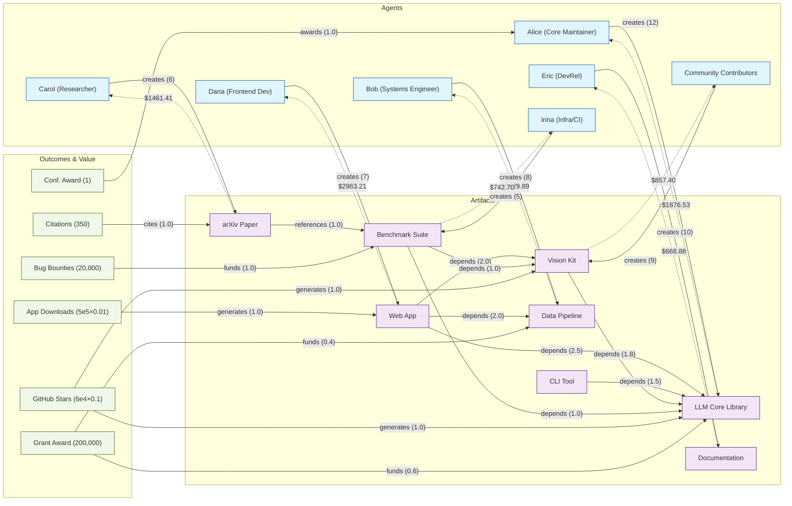

### Open-Source Dataset

You’re allocating a $10,000 pool across contributors to an AI toolkit. You want a split that respects structural leverage (dependencies) and realized value (downloads, grants, awards).

What you’ll do
- Run the evaluator on the OSS presentation graph
- Inspect the payout split and why it looks that way
- Note what to tweak next (α, edge weights)

Run it
```bash
bun run examples/oss.ts
```

Source: `examples/oss.ts`. This diagram shows all nodes and edges in the OSS presentation dataset and the payout amounts (pool = 10,000) as dotted lines from artifacts to their creators.



Numbers will vary with config, weights, and α.

### What this chart shows

- **Node types**
  - **Agents**: people/teams who create artifacts.
  - **Artifacts**: outputs (libraries, apps, docs, papers).
  - **Outcomes**: value signals (downloads, stars, citations, grants, bounties, awards).

- **Forward edges (solid)**
  - **creates**: Agent → Artifact with effort weights.
  - **depends/references**: Artifact → Artifact showing structural leverage.
  - **generates/funds/cites/awards**: Outcome → Artifact/Agent injecting value.

- **Reverse edges (dotted payouts)**
  - Artifact -.-> Agent labeled with payout dollars from a 10,000 pool (hybrid PageRank result).

- **How value moves**
  - Outcomes feed value into specific artifacts/agents.
  - Dependencies pull credit upstream toward foundational artifacts.
  - Hybrid score combines forward structure with reverse value (α=0.55 here), then normalizes to the pool.

- **Why these payouts (intuition)**
  - Web App gets large Downloads and depends on multiple artifacts → strong credit to Dana.
  - LLM Core is heavily depended on, receives Stars and Grant, plus Alice’s Award → strong credit to Alice.
  - Data Pipeline, Vision Kit, Benchmarks, Docs inherit credit via dependencies and valuation edges → payouts to Bob, Community, Irina, Eric.

#### Sample output

```text
--- Presentation Dataset: Open-Source AI Toolkit ---
Nodes: 21, Edges: 23

Top Agents by Hybrid Score:
Dana (Frontend Dev)          0.052067
Alice (Core Maintainer)      0.032973
Carol (Researcher)           0.025679
Bob (Systems Engineer)       0.025125
Community Contributors       0.015065
Irina (Infra/CI)             0.013050
Eric (DevRel)                0.011753

Reward Split (pool=10,000):
Dana (Frontend Dev)          2963.21
Alice (Core Maintainer)      1876.53
Carol (Researcher)           1461.41
Bob (Systems Engineer)       1429.89
Community Contributors       857.40
Irina (Infra/CI)             742.70
Eric (DevRel)                668.88

Alpha Sensitivity:
Agent                       α=0       α=0.25    α=0.5     α=0.75    α=1
------------------------------------------------------------------------------
Dana (Frontend Dev)         0.089587  0.072532  0.055478  0.038423  0.021369
Alice (Core Maintainer)     0.024955  0.028599  0.032244  0.035888  0.039533
Carol (Researcher)          0.030946  0.028552  0.026157  0.023763  0.021369
Bob (Systems Engineer)      0.029715  0.027629  0.025542  0.023455  0.021369
Community Contributors      0.007361  0.010863  0.014365  0.017867  0.021369
Irina (Infra/CI)            0.002882  0.007504  0.012126  0.016747  0.021369
Eric (DevRel)               0.000000  0.005342  0.010684  0.016027  0.021369
```


